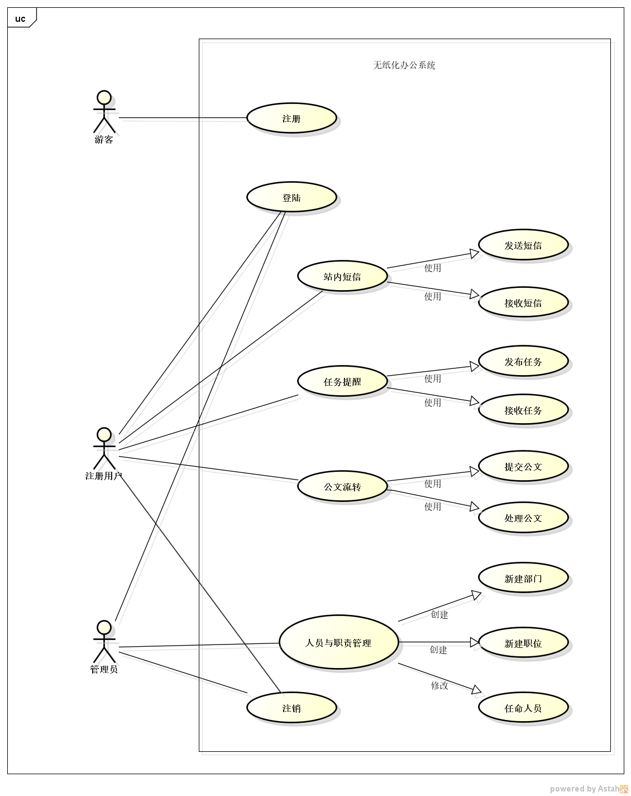

# 无纸化办公系统
### 需求分析报告

1.[问题定义](#问题定义)

2.[功能需求](#功能需求)

3.[非功能需求](#非功能需求)

4.[功能模型](#功能模型)

5.[数据(对象)模型](#对象模型)

6.[开发计划](#开发计划)

7.[风险分析](#风险分析)

---
##### 问题定义
&emsp;&emsp;传统的公文流转方式繁杂费时，无纸化办公系统大大简化了类似的公文流转处理过程（下级编辑公文后提交到指定上级，上级可同意或不同意或继续提交到指定上级）；该系统也集合了许多其他的办公所需功能：包括人员与职责管理（编辑部门，职位名称与对应级别）、站内短信（可发送信息到任一注册用户）、任务提醒（上级编辑并发布任务到下级）。

##### 功能需求
* R001：本系统支持新用户注册功能。注册信息包括用户名、密码。其中用户名要求：4-16个字符，为英文字母大小写、下划线、数字的任意组合，用户名必须唯一；密码要求：6-16个字符，为英文字母大小写、下划线、数字的组合。注册后用户名不可更改，密码可修改（输入原密码与新密码，新密码格式要求同上）
* R002：人员与职责管理。管理员自定义部门（1-10个中英文字符）和职位名称（1-10个中英文字符）与其相匹配的等级（数字[1，100]）。管理员可指定任一用户到任一职位。（管理员用户名“root”，初始密码密码默认为“123456”）
* R003：站内短信。可向公司内任意人员发送文字消息(一条1-255个字符)。
* R004：任务提醒。编辑任务（1-255个字符）后选择其同一部门一名下级人员发布，被指定的下级人员得到任务信息。
* R005：公文流转。编辑公文（1-255个字符）后选择其同一部门一名上级人员发送，被指定的上级人员得到公文，可选择（同意|不同意|指定同一部门的一名上级继续流转）。编辑该公文的下级可随时查看公文处理进度(同意|不同意|未处理)

##### 非功能需求
* R101：在网络良好的状态下，用户发送站内短信后，必须在5秒钟之内送达指定用户。
* R102：在网络良好的状态下，用户发布任务后，必须在5秒钟之内送达指定下级。
* R103：在网络良好的状态下，用户提交公文后，必须在5秒钟之内送达指定上级。
* R104：本系统支持各大浏览器（IE, Microsoft Edge，Fire Fox，Chrome，Safari）。

##### 功能模型

##### 对象模型

##### 开发计划

###### 资源需求
开发需要两台电脑以及两名大学生，运行需要一台电脑作为服务器，一台运行

###### 进度计划
* 三：				确定题目，可行性分析
* 四、五、六：		需求分析
* 七、八、九：		设计后台基础服务框架（实现注册登陆等基础功能）与基础前端页面
* 十、十一、十二：	完善框架，添加功能，实现人员与职责管理
* 十三、十四：继续完善功能，实现任务提醒，站内短信与公文流转
* 十五：	页面美化，调试

##### 风险分析
* 进度可能落后于计划。对策：严格按照计划进行编程任务
* 功能不够多，实用性不强。对策：考虑添加更多实用功能
* 不够人性化。对策：反复调试与思考，找到最佳操作方式并实现
